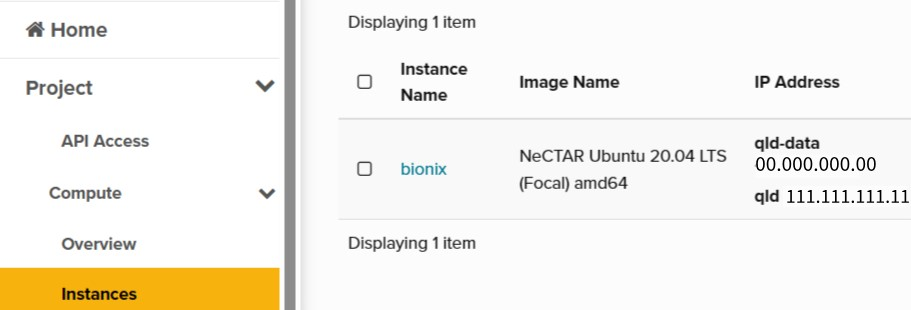

# Contents

[1. Setting up Nectar: Launching a Virtual Machine](#1-setting-up-nectar-launching-a-virtual-machine)

[2. Setting up Nix on Nectar](#2-setting-up-nix-on-nectar)

# 1. Setting up Nectar: Launching a Virtual Machine

This section will talk about how to set your new Nectar account up and launch your first virtual machine (VM). Go through the Nectar tutorials hyperlinked in each main step. The bullet notes are only to help out if you get confused at some sections.

1. [**Set up a keypair for use**](https://tutorials.rc.nectar.org.au/keypairs/01-overview). Think of it as a setting up a secure password to access the VM.
    - **Part 4: ssh-keygen method**
        - Run the terminal commands on your command line (e.g. PowerShell for Windows/Terminal for Mac)
        - To upload the keypair, use the navigation bar of the Nectar dashboard to go Project → Compute → Key Pairs

2. [**Launch a VM**](https://tutorials.rc.nectar.org.au/launching-virtual-machines/01-overview). 
    - **Part 3: Starting the launch dialog**:
        - Details → Availability Zone: Pick ‘Any Availability Zone’
        - For all other fields to fill in, just follow the tutorial.

3. [**Connect Nectar Account and VM instance**](https://tutorials.rc.nectar.org.au/connecting/01-overview)
    - **Part 2: Terminal and ssh**
        - Run the terminal commands on your command line as usual
        - The SSH command for basic connection/logging in to the VM is in the format `ssh image_Linux_Distribution@IP_address`

            You can check these details at the the Instances section of the Dashboard. Example:
            

            The SSH command to log in would be `ssh ubuntu@111.111.111.11`
            
    - **Part 3: Setting a password to access your instance**
        - Set the password on your computer’s command line as a continuation from part 2, ***not*** on the web VNC console

# 2. Setting up Nix on Nectar

1. Login to Nectar VM on your command line
2. Install Nix on the VM with the command `curl -L https://nixos.org/nix/install | sh`
3. Rerun command prompt and login to Nectar VM again
4. Try to run the following instruction from Kai Bing's 'BioNix-Getting-Started' repo:

    For the BioNix project, we would like to utilise the nix flakes, this allows us to create builds in a strictly determined environment and create same outputs on different machines. Once you have installed Nix, add the following line to /etc/nix/nix.conf

    `experimental-features = nix-command flakes`
    
    If you're operating on WSL like me, add to ~/.config/nix/nix.conf (where the current shell user is a nix trusted user).
    
    To check if the installation is successful, input the following command line
    
    `$ nix flake --help`
    
    If this doesn't work, proceed for now.
5. Test if BioNix works on the VM by trying to run:

    ```console
    nix build github:WEHI-ResearchComputing/BioNix-qc-pipe dir=qc-pipe/biobloom && sha256sum -c <(echo "817e25ba80dcbb89b8a5b5e9ba48dc82eba38f1cb54ae989fd18d0a6306b1718" ./result)
    ```

    If you get an error message saying

    ```console
    error: experimental Nix feature 'nix-command' is disabled; use '--extra-experimental-features nix-command to override
    ```
    
    Run the following command instead:
    
    ```console
    nix --extra-experimental-features nix-command --extra-experimental-features flakes build github:WEHI-ResearchComputing/BioNix-qc-pipe?dir=qc-pipe/biobloom && sha256sum -c <(echo "817e25ba80dcbb89b8a5b5e9ba48dc82eba38f1cb54ae989fd18d0a6306b1718" ./result)
    ```

    If BioNix works, you should get an output saying `./result: OK`
